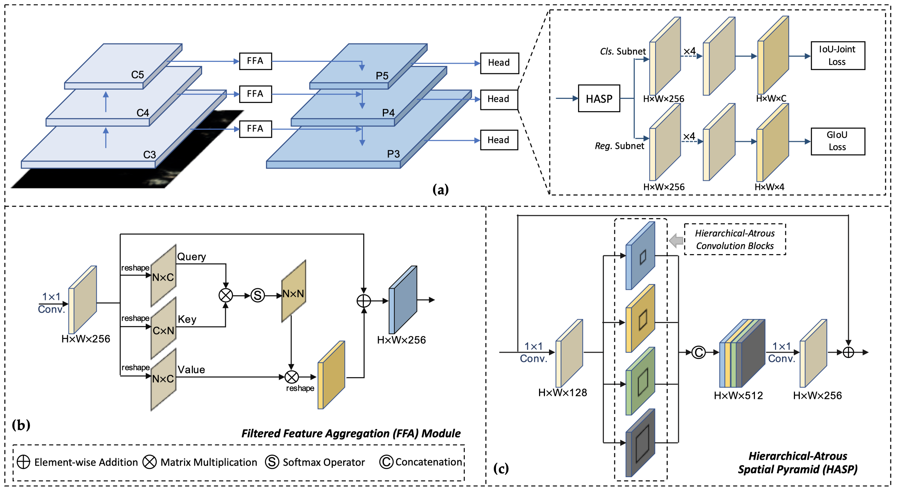

# LR-TSDet: Towards Tiny Ship Detection in Low Resolution Remote Sensing Images
Official implementation of LR-TSDet. This repository is based on [mmdetection](https://github.com/open-mmlab/mmdetection).

>   [LR-TSDet: Towards Tiny Ship Detection in Low Resolution Remote Sensing Images](https://github.com/Lausen-Ng/LR-TSDet)
>
>   [Jixiang Wu](http://lausen-ng.github.io/), [Zongxu Pan](http://people.ucas.ac.cn/~panzx), Bin Lei, Yuxin Hu.

## Introduction

Recently, deep-learning based methods have made great improvements in object detection in remote sensing images (RSIs). However, detecting tiny objects in low-resolution images is still confronting challenges. The features of objects are not distinguishable enough due to the tiny size and confused background. To address these issues, we first introduce a newly collected dataset for tiny ship detection in low-resolution RSIs, called GF1-LRSD. The resolution of images is 16m and the mean size of objects is about 10.9 pixels, which are much smaller than the public RSI datasets. Then we present an effective tiny ship detector termed as LR-TSDet, consisting of three key components: the filtered feature aggregation (FFA) module, the hierarchical-atrous spatial pyramid (HASP) module, and the IoU-Joint loss. The FFA captures long-range dependencies by calculating the similarity matrix, so as to strengthen the response of instances. The HASP obtains deep semantic information while maintaining the resolution of feature maps by aggregating four parallel hierarchical-atrous convolution blocks of different dilation rates. The IoU-Joint loss is proposed to alleviate the inconsistency between classification and regression tasks. Extensive experiments on GF1-LRSD show that our method outperforms competitors, proving its effectiveness and generality.



## Updates

-   2021-08-10, Code is released.

## Installation & Useage

Please refer to 

## Citation

If you find this repository/work helpful in your research, welcome to cite the paper.

```
@article{wu2021lrtsdet,
  title={LR-TSDet: Towards Tiny Ship Detection in Low Resolution Remote Sensing Images},
  author={Wu, Jixiang and Pan, Zongxu, and Lei, Bin and Hu, Yuxin},
  journal={Remote Sensing},
  volume={x},
  number={x},
  pages={x},
  year={2021},
  publisher={Multidisciplinary Digital Publishing Institute}
}
```

